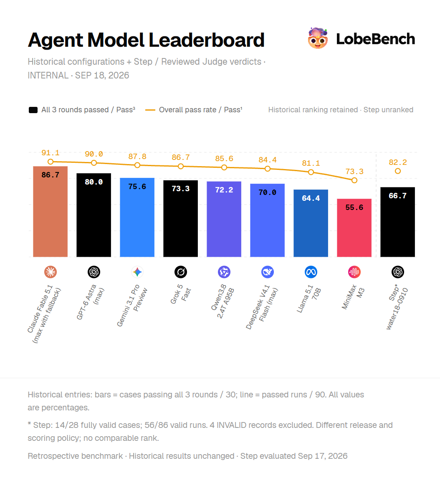
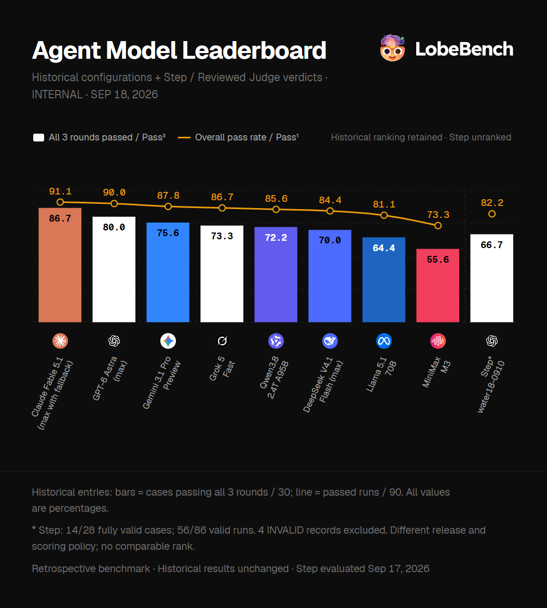
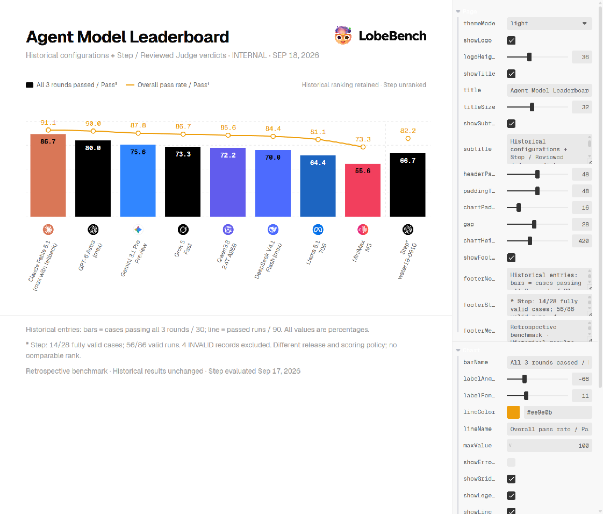
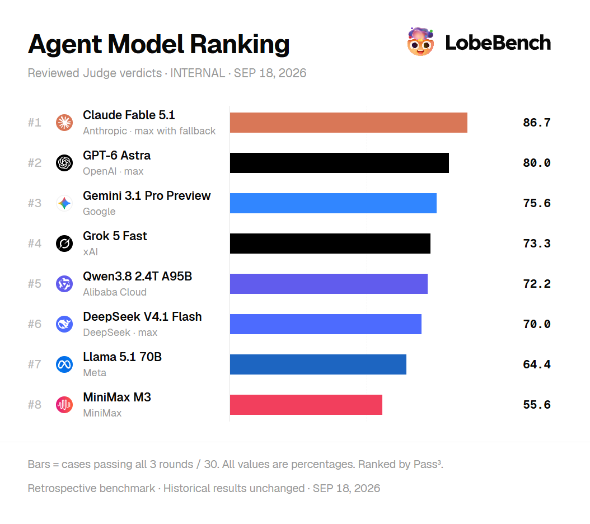
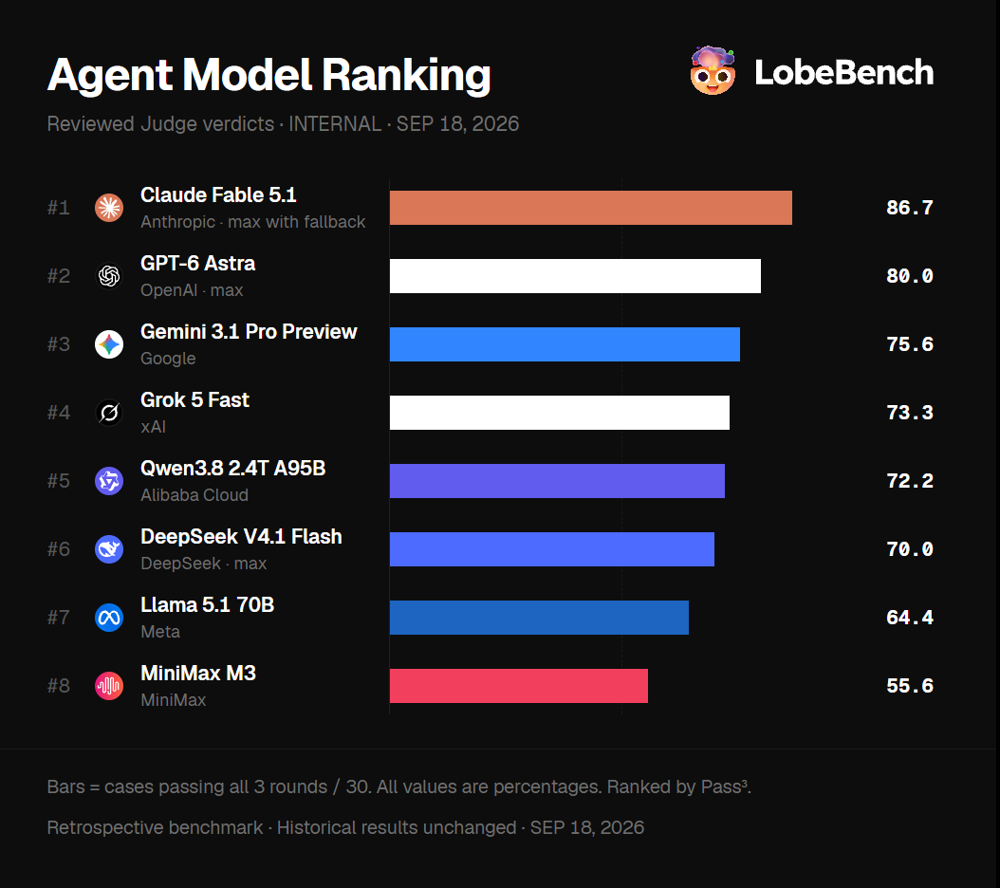
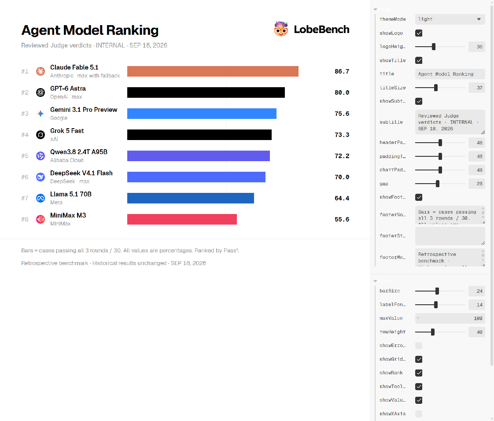

# LobeBench Skill

模型评测海报。柱状或横向排行都可以。

直接说需求，比如：

> 做一张 Agent 模型排行海报

> 用柱状图，加 Pass¹ 折线，Step 放未排名

> 横向排名，高亮 Claude，不要误差棒

数据 JSON、表格、直接列都行，至少要有模型名和分数：

```json
[
  { "name": "Claude Fable 5.1", "provider": "Anthropic", "score": 86.7, "line": 91.1 },
  { "name": "GPT-6 Astra", "provider": "OpenAI", "score": 80, "line": 90, "error": 1.2 }
]
```

有折线、误差、要高亮或未排名的条目，一起写上。标题、脚注想定也可以说。

## 柱状对比


| Light                                                | Dark                                               |
| ---------------------------------------------------- | -------------------------------------------------- |
|  |  |


右边是配置面板，亮暗色、标题、边距、图表都能直接改。



## 横向排名


| Light                                                  | Dark                                                 |
| ------------------------------------------------------ | ---------------------------------------------------- |
|  |  |


右边是配置面板，亮暗色、标题、边距、图表都能直接改。

